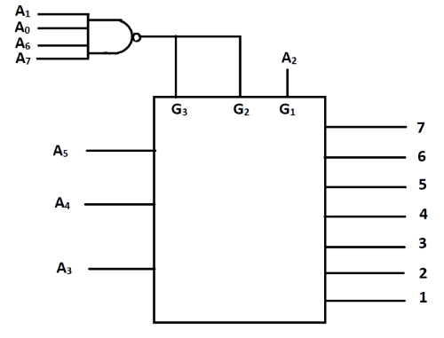

## Post test
#### Please attempt the following questions

Q1. Using 3-to-8 line Decoder we can construct

&nbsp;  a.  4 to 16 decoder   
&nbsp;  b.  5 to 32 decoder    
&nbsp;  c.  2 to 4 decoder   
&nbsp;  d.  3 to 10 decoder    
  
A      Only a         
B      Both a & d           
C     All  
<b>D     Only a & b</b>  
 
  

Q2. IC 74138 can be used for

A     1 to 8 demultiplexer only  
B     3 to 8 decoder only  
C     3 to 10 decoder only  
<b>D     Both (A) & (B)</b>  
 
  

Q3. Number of 74138 ICs required to get 1 to 24 Decoder is

<b>A     3</b>  
B     2  
C     4  
D     1  
 
  

Q4. How many 3- to -8 line decoders are required for 1-to 13 -decoder?

A     3  
B     2  
<b>C     4</b>  
D     1  
 
  

Q5. Which gate is used with four 74138 ICs to get 5 to 32 Decoder?

A     AND gate  
B     OR gate  
C     XOR gate  
<b>D     NOT gat</b>  
 
  

Q6. A circuit which converts some binary code into a singular active output representing its numerical value is a

A     Demultiplexer  
B     Comparator  
<b>C     Decoder</b>  
D     Multiplexer  
 
  

Q7. The delay time of IC 74138 is \_\_\_\_\_\_\_ the typical access time of the memory.

<b>A     Short propagation delay times</b>  
B     Large propagation delay times  
C     Very large propagation delay times  
D     None of the above.    
 
  

Q8. Which of the following represents number of output lines for decoder with four input lines?

A     14  
B     15  
<b>C     16</b>  
D     17    
 
  

Q9. \_\_\_\_\_\_\_ are used for converting one type of number system into another type of number system. 

<b>A     Decoder</b>  
B     Logic gate   
C     Half adder  
D     Full adder   
 
  

Q10. Which line goes low if the input to the 3-to-8 decoder (74LS138) (A1 - A0) = 1101111…

   

A     1  
<b>B     3</b>  
C     5  
D     6  
