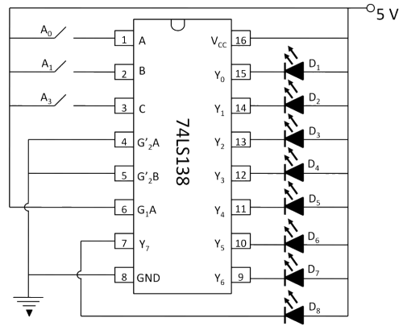
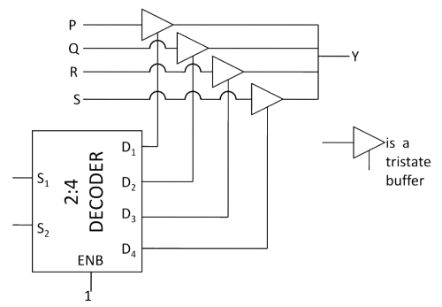
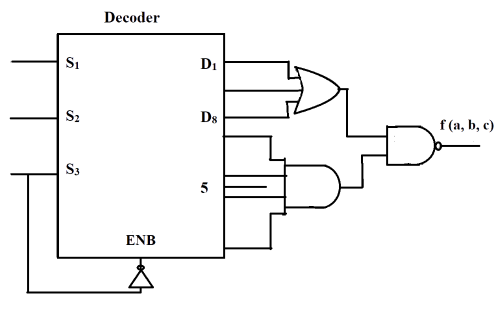

##  Pre Test 
#### Please attempt the following questions

Q1. The number of individual decoders required to construct desired decoder circuit is given by ___________ ,  
    where 'n' is the number of input lines in available decoder and 'N' is the number of input lines in desired decoder. 
 
A      2(N/n)         
B      2(N+n)           
<b>C     2(N-n)</b>    
D    2(Nn)  
 
  

Q2. The three enable pins in IC 74138 are as

A     Two pins are active low and one pin is active high.  
<b>B     Two pins are active high and one pin is active low.</b>  
C     Three pins are active high.    
D     Three pins are active low.  
 
  

Q3. Benefit of 3 enable pins in IC 74138 is

A     Increase the necessity of three outside gates.  
<b>B     Decrease the necessity of three outside gates.</b>  
C     Increase the necessity of three inside gates.  
D     Decrease the necessity of three inside gates.  
 
  

Q4. Advantages of IC 74138 include

A     Low speed.  
<b>B     Low power consumption.</b>  
C     High Propagation delay.  
D     It can used for encoding.  
 
  

Q5. For making a 4 to 16 Decoder by using logic gates only we require

<b>A     4 NOT gates and 16 AND gates.</b>  
B     16 NOT gates and 4 AND gates.  
C     8 NOT gates and 8 AND gates.  
D     3 NOT gates and 8 AND gates.  
 
  

Q6. Why are the enable lines specifically used for connecting two or more IC packages in accordance to its application in decoder circuit?

A     It allows the reduction of digital function into similar function with more inputs and outputs.  
B     It allows the reduction of digital function into different function with more inputs and outputs.  
<b>C     It allows the expansion of digital function into similar function with more inputs and outputs.</b>  
D     It allows the expansion of digital function into different function with more inputs and outputs.    
 
  

Q7. Output 6 of 74138 octal decoder is selected when it is enabled by a data input of

A     A0 = 0, A1 = 0, A2 = 1  
B     A0 = 1, A1 = 1, A2 = 0  
<b>C     A0 = 0, A1 = 1, A2 = 1</b>  
D     A0 = 1, A1 = 0, A2 = 0     
 
  

Q8. How many 1-of-16 decoders are required for decoding a 7-bit binary number? 

A     5  
B     6   
C     7  
<b>D     8</b>   
 
  
Q9. The functionality implemented by the circuit below is

A     2 to 1 multiplexer  
<b>B     4 to 1 multiplexer</b>  
C     7 to 1 multiplexer  
D     6 to 1 multiplexer  
 
  

Q10. The Boolean expression f(a,b,c) in its canonical form for the decoder circuit shown is
  
   

A     ∏ M (4,6)  
B     ∑ m (0,1,2,3,5,7)  
<b>C     ∑ m (4,6)</b>  
D     ∏ M (0,1,2,3,5)  