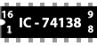
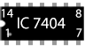
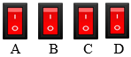
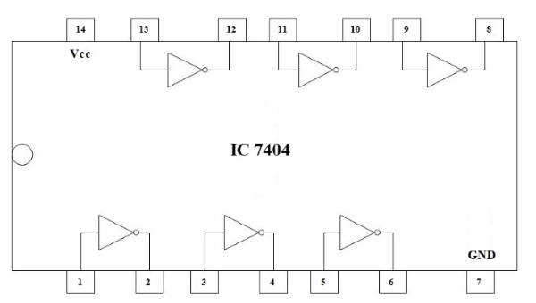
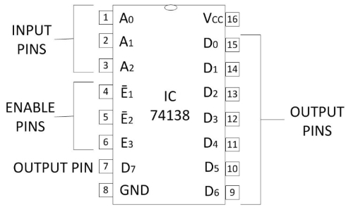
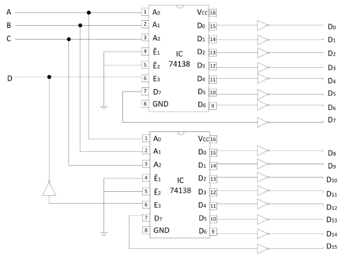

## Procedure
 

1.  Click on the **Component** button to place components on the table.

&emsp; &emsp; ")&emsp; &emsp; &emsp; &emsp; &emsp; &emsp;   

**Fig. 1 Components**  

  
2.  Make connections as per the circuit diagram and pin diagram of ICs or according to connection table.

**Fig. 2 Circuit Diagram of 4-to-16 decoder**

**Fig. 3 Pin Diagram of IC 74138**
 

**Fig. 4 Pin Diagram of IC 7404**

  

**Table 1: Connection table**   

3.  Click on **Check Connections** button. If connections are right, click on **‘OK’**, then **Simulation** will become active.
4.  Provide the input by clicking toggle switches **A, B, C** and **D**.
5.  Fill the observed values in the **Truth Table**.
6.  Verify Truth Table by clicking on **Check button**, if outputs are correct then click on **OK**.
7.  Click on the **Reset** button to reset the page.

