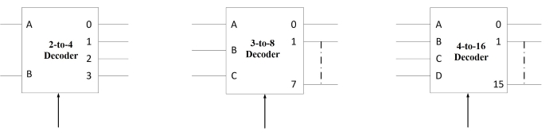
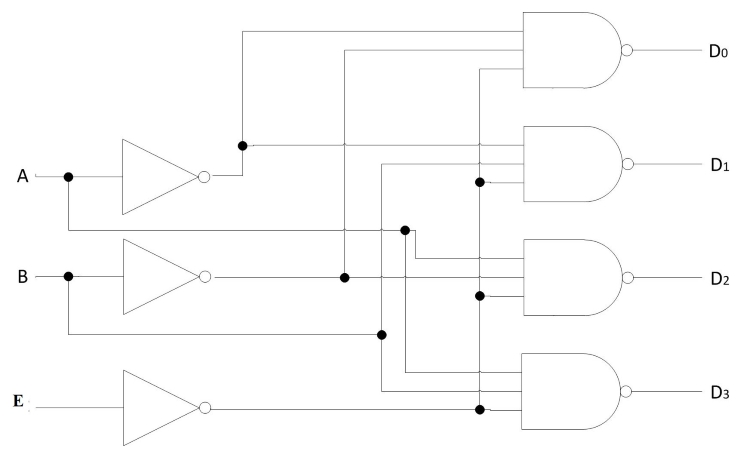
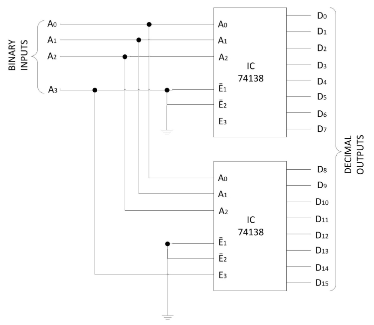

### Introduction

### **Decoders**

A decoder is a combinational circuit that converts binary information from 'n' input lines to a maximum of 2n unique output lines. If the n-bit coded information has unused or ‘don’t care’ combinations, the decoder may have fewer than 2n output lines. As an illustration, if there are three input lines, it can have a maximum of eight unique output lines. If in the three-bit input code, the only used three-bit combinations are 000, 001, 010, 100, 110 and 111 (011 and 101 being either unused or don’t care combinations), then this decoder will have only six output lines. In general, if 'n' and 'm' are the numbers of input and output lines respectively then m ≤ 2n. The decoders presented here are called n-to-m line decoders. The 'n' inputs are decoded into 'm' outputs, each representing one of the minterms of the 'n' input variables. As an example, consider the 3-to-8 line decoder circuit of Fig. 1. The three inputs are decoded into eight outputs, each representing one of the minterms of the three input variables. The three 'inverters' provide the complement of the input variables and each one of the eight 'AND' gates generate one of the minterms. A particular application of this decoder is binary-to-octal conversion. The input variables represent a binary number and the output variables represent the eight digits of a number in the octal number system. However, a 3-to-8 line decoder can be used for decoding any three-bit code to provide eight outputs, one for each element of the code.

  

**Fig 1: 3-to-8 line decoder**

The operation of the decoder may be clarified by the truth table listed in Table 1. For each possible input combination, there are seven outputs that are equal to 0 and only one of them is equal to 1. The output whose value is equal to 1 represents the minterm equivalent of the binary number currently available in the input lines.

**Table: 1 Truth table of 3-to-8 line decoder** 

<table  align="center" style="text-align:center" >
                    <tr style="border:1px solid black;font-size:130%;border-collapse:collapse;">
                        <th colspan="3" ; style="border:1px solid black;border-collapse:collapse;text-align:center">INPUTS</th>
                        <th colspan="8" ; style="border:1px solid black;border-collapse:collapse;text-align:center">OUTPUTS</th>
                    </tr>
                    <tr>
                        <th style="border:1px solid black;font-size:120%;border-collapse:collapse;text-align:center">X</th>
                        <th style="border:1px solid black;font-size:120%;border-collapse:collapse;text-align:center">Y</th>
                        <th style="border:1px solid black;font-size:120%;border-collapse:collapse;text-align:center">Z</th>
                        <th style="border:1px solid black;font-size:120%;border-collapse:collapse;text-align:center">D0</th>
                        <th style="border:1px solid black;font-size:120%;border-collapse:collapse;text-align:center">D1</th>
                        <th style="border:1px solid black;font-size:120%;border-collapse:collapse;text-align:center">D2</th>
                        <th style="border:1px solid black;font-size:120%;border-collapse:collapse;text-align:center">D3</th>
                        <th style="border:1px solid black;font-size:120%;border-collapse:collapse;text-align:center">D4</th>
                        <th style="border:1px solid black;font-size:120%;border-collapse:collapse;text-align:center">D5</th>
                        <th style="border:1px solid black;font-size:120%;border-collapse:collapse;text-align:center">D6</th>
                        <th style="border:1px solid black;font-size:120%;border-collapse:collapse;text-align:center">D7</th>
                    </tr>
                    <tr>
                        <td style="border:1px solid black;font-size:110%;border-collapse:collapse;">0</td>
                        <td style="border:1px solid black;font-size:110%;border-collapse:collapse;">0</td>
                        <td style="border:1px solid black;font-size:110%;border-collapse:collapse;">0</td>
                        <td style="border:1px solid black;font-size:110%;border-collapse:collapse;">1</td>
                        <td style="border:1px solid black;font-size:110%;border-collapse:collapse;">0</td>
                        <td style="border:1px solid black;font-size:110%;border-collapse:collapse;">0</td>
                        <td style="border:1px solid black;font-size:110%;border-collapse:collapse;">0</td>
                        <td style="border:1px solid black;font-size:110%;border-collapse:collapse;">0</td>
                        <td style="border:1px solid black;font-size:110%;border-collapse:collapse;">0</td>
                        <td style="border:1px solid black;font-size:110%;border-collapse:collapse;">0</td>
                        <td style="border:1px solid black;font-size:110%;border-collapse:collapse;">0</td>
                    </tr>
                    <tr>
                        <td style="border:1px solid black;font-size:110%;border-collapse:collapse;">0</td>
                        <td style="border:1px solid black;font-size:110%;border-collapse:collapse;">0</td>
                        <td style="border:1px solid black;font-size:110%;border-collapse:collapse;">1</td>
                        <td style="border:1px solid black;font-size:110%;border-collapse:collapse;">0</td>
                        <td style="border:1px solid black;font-size:110%;border-collapse:collapse;">1</td>
                        <td style="border:1px solid black;font-size:110%;border-collapse:collapse;">0</td>
                        <td style="border:1px solid black;font-size:110%;border-collapse:collapse;">0</td>
                        <td style="border:1px solid black;font-size:110%;border-collapse:collapse;">0</td>
                        <td style="border:1px solid black;font-size:110%;border-collapse:collapse;">0</td>
                        <td style="border:1px solid black;font-size:110%;border-collapse:collapse;">0</td>
                        <td style="border:1px solid black;font-size:110%;border-collapse:collapse;">0</td>
                    </tr>
                    <tr>
                        <td style="border:1px solid black;font-size:110%;border-collapse:collapse;">0</td>
                        <td style="border:1px solid black;font-size:110%;border-collapse:collapse;">1</td>
                        <td style="border:1px solid black;font-size:110%;border-collapse:collapse;">0</td>
                        <td style="border:1px solid black;font-size:110%;border-collapse:collapse;">0</td>
                        <td style="border:1px solid black;font-size:110%;border-collapse:collapse;">0</td>
                        <td style="border:1px solid black;font-size:110%;border-collapse:collapse;">1</td>
                        <td style="border:1px solid black;font-size:110%;border-collapse:collapse;">0</td>
                        <td style="border:1px solid black;font-size:110%;border-collapse:collapse;">0</td>
                        <td style="border:1px solid black;font-size:110%;border-collapse:collapse;">0</td>
                        <td style="border:1px solid black;font-size:110%;border-collapse:collapse;">0</td>
                        <td style="border:1px solid black;font-size:110%;border-collapse:collapse;">0</td>
                    </tr>
                    <tr>
                        <td style="border:1px solid black;font-size:110%;border-collapse:collapse;">0</td>
                        <td style="border:1px solid black;font-size:110%;border-collapse:collapse;">1</td>
                        <td style="border:1px solid black;font-size:110%;border-collapse:collapse;">1</td>
                        <td style="border:1px solid black;font-size:110%;border-collapse:collapse;">0</td>
                        <td style="border:1px solid black;font-size:110%;border-collapse:collapse;">0</td>
                        <td style="border:1px solid black;font-size:110%;border-collapse:collapse;">0</td>
                        <td style="border:1px solid black;font-size:110%;border-collapse:collapse;">1</td>
                        <td style="border:1px solid black;font-size:110%;border-collapse:collapse;">0</td>
                        <td style="border:1px solid black;font-size:110%;border-collapse:collapse;">0</td>
                        <td style="border:1px solid black;font-size:110%;border-collapse:collapse;">0</td>
                        <td style="border:1px solid black;font-size:110%;border-collapse:collapse;">0</td>
                    </tr>
                <tr>
                        <td style="border:1px solid black;font-size:110%;border-collapse:collapse;">1</td>
                        <td style="border:1px solid black;font-size:110%;border-collapse:collapse;">0</td>
                        <td style="border:1px solid black;font-size:110%;border-collapse:collapse;">0</td>
                        <td style="border:1px solid black;font-size:110%;border-collapse:collapse;">0</td>
                        <td style="border:1px solid black;font-size:110%;border-collapse:collapse;">0</td>
                        <td style="border:1px solid black;font-size:110%;border-collapse:collapse;">0</td>
                        <td style="border:1px solid black;font-size:110%;border-collapse:collapse;">0</td>
                        <td style="border:1px solid black;font-size:110%;border-collapse:collapse;">1</td>
                        <td style="border:1px solid black;font-size:110%;border-collapse:collapse;">0</td>
                        <td style="border:1px solid black;font-size:110%;border-collapse:collapse;">0</td>
                        <td style="border:1px solid black;font-size:110%;border-collapse:collapse;">0</td>
                    </tr>
                    <tr>
                        <td style="border:1px solid black;font-size:110%;border-collapse:collapse;">1</td>
                        <td style="border:1px solid black;font-size:110%;border-collapse:collapse;">0</td>
                        <td style="border:1px solid black;font-size:110%;border-collapse:collapse;">1</td>
                        <td style="border:1px solid black;font-size:110%;border-collapse:collapse;">0</td>
                        <td style="border:1px solid black;font-size:110%;border-collapse:collapse;">0</td>
                        <td style="border:1px solid black;font-size:110%;border-collapse:collapse;">0</td>
                        <td style="border:1px solid black;font-size:110%;border-collapse:collapse;">0</td>
                        <td style="border:1px solid black;font-size:110%;border-collapse:collapse;">0</td>
                        <td style="border:1px solid black;font-size:110%;border-collapse:collapse;">1</td>
                        <td style="border:1px solid black;font-size:110%;border-collapse:collapse;">0</td>
                        <td style="border:1px solid black;font-size:110%;border-collapse:collapse;">0</td>
                    </tr>
                 <tr>
                        <td style="border:1px solid black;font-size:110%;border-collapse:collapse;">1</td>
                        <td style="border:1px solid black;font-size:110%;border-collapse:collapse;">1</td>
                        <td style="border:1px solid black;font-size:110%;border-collapse:collapse;">0</td>
                        <td style="border:1px solid black;font-size:110%;border-collapse:collapse;">0</td>
                        <td style="border:1px solid black;font-size:110%;border-collapse:collapse;">0</td>
                        <td style="border:1px solid black;font-size:110%;border-collapse:collapse;">0</td>
                        <td style="border:1px solid black;font-size:110%;border-collapse:collapse;">0</td>
                        <td style="border:1px solid black;font-size:110%;border-collapse:collapse;">0</td>
                        <td style="border:1px solid black;font-size:110%;border-collapse:collapse;">0</td>
                        <td style="border:1px solid black;font-size:110%;border-collapse:collapse;">1</td>
                        <td style="border:1px solid black;font-size:110%;border-collapse:collapse;">0</td>
                    </tr>
                    <tr>
                        <td style="border:1px solid black;font-size:110%;border-collapse:collapse;">1</td>
                        <td style="border:1px solid black;font-size:110%;border-collapse:collapse;">1</td>
                        <td style="border:1px solid black;font-size:110%;border-collapse:collapse;">1</td>
                        <td style="border:1px solid black;font-size:110%;border-collapse:collapse;">0</td>
                        <td style="border:1px solid black;font-size:110%;border-collapse:collapse;">0</td>
                        <td style="border:1px solid black;font-size:110%;border-collapse:collapse;">0</td>
                        <td style="border:1px solid black;font-size:110%;border-collapse:collapse;">0</td>
                        <td style="border:1px solid black;font-size:110%;border-collapse:collapse;">0</td>
                        <td style="border:1px solid black;font-size:110%;border-collapse:collapse;">0</td>
                        <td style="border:1px solid black;font-size:110%;border-collapse:collapse;">0</td>
                        <td style="border:1px solid black;font-size:110%;border-collapse:collapse;">1</td>
                    </tr>
                </table> 

  
Fig. 2 shows the circuit representation of 2-to-4, 3-to-8 and 4-to-16 line decoders.

  

**Fig 2: Circuit representation of 2-to-4, 3-to-8 and 4-to-16 line decoders** 

  
### **Combinational Logic Implementation**

A decoder provides 2n minterms of n input variables. Each asserted output of the decoder is associated with a unique pattern of input bits. Since any Boolean function can be expressed in sum-of-minterms form, a decoder that generates the minterms of the function together with an external 'OR' gate that forms their logical sum provides a hardware implementation of the function. In this way, any combinational circuit with 'n' inputs and 'm' outputs can be implemented with an n-to-2n line decoder and 'm' 'OR' gates.

The procedure for implementing a combinational circuit by means of a decoder and 'OR' gates require that the Boolean function for the circuit be expressed as a sum of minterms. A decoder is then chosen that generates all the minterms of the input variables. The inputs to each 'OR' gate are selected from the decoder outputs according to the list of minterms of each function. This procedure will be illustrated by an example that implements a full-adder circuit.

**Table: 2 Truth table of full adder** 

  
<table align="center" style="text-align:center">
                        <tr style="border:1px solid black;font-size:130%;border-collapse:collapse;">
                            <th style="border:1px solid black;border-collapse:collapse;width:100px;text-align:center;">MINTERMS</th>
                            <th colspan="3" ; style="border:1px solid black;border-collapse:collapse;width:100px;text-align:center;">INPUTS</th>
                            <th colspan="2" ; style="border:1px solid black;border-collapse:collapse;width:100px;text-align:center;">OUTPUTS</th>
                        </tr>
                        <tr>
                            <th style="border:1px solid black;font-size:120%;border-collapse:collapse;width:100px;text-align:center;"></th>
                            <th style="border:1px solid black;font-size:120%;border-collapse:collapse;width:100px;text-align:center;">A</th>
                            <th style="border:1px solid black;font-size:120%;border-collapse:collapse;width:100px;text-align:center;">B</th>
                            <th style="border:1px solid black;font-size:120%;border-collapse:collapse;width:100px;text-align:center;">Cin</th>
                            <th style="border:1px solid black;font-size:120%;border-collapse:collapse;width:100px;text-align:center;">Cout</th>
                            <th style="border:1px solid black;font-size:120%;border-collapse:collapse;width:100px;text-align:center;">D</th>
                        </tr>
                        <tr>
                            <td style="border:1px solid black;font-size:110%;border-collapse:collapse;width:100px;text-align:center;">0</td>
                            <td style="border:1px solid black;font-size:110%;border-collapse:collapse;width:100px;text-align:center;">0</td>
                            <td style="border:1px solid black;font-size:110%;border-collapse:collapse;width:100px;text-align:center;">0</td>
                            <td style="border:1px solid black;font-size:110%;border-collapse:collapse;width:100px;text-align:center;">0</td>
                            <td style="border:1px solid black;font-size:110%;border-collapse:collapse;width:100px;text-align:center;">0</td>
                            <td style="border:1px solid black;font-size:110%;border-collapse:collapse;width:100px;text-align:center;">0</td>
                        </tr>
                        <tr>
                            <td style="border:1px solid black;font-size:110%;border-collapse:collapse;width:100px;text-align:center;">1</td>
                            <td style="border:1px solid black;font-size:110%;border-collapse:collapse;width:100px;">0</td>
                            <td style="border:1px solid black;font-size:110%;border-collapse:collapse;width:100px;">0</td>
                            <td style="border:1px solid black;font-size:110%;border-collapse:collapse;width:100px;">1</td>
                            <td style="border:1px solid black;font-size:110%;border-collapse:collapse;width:100px;">0</td>
                            <td style="border:1px solid black;font-size:110%;border-collapse:collapse;width:100px;">1</td>
                        </tr>
                        <tr>
                            <td style="border:1px solid black;font-size:110%;border-collapse:collapse;width:100px;text-align:center;">2</td>
                            <td style="border:1px solid black;font-size:110%;border-collapse:collapse;width:100px;">0</td>
                            <td style="border:1px solid black;font-size:110%;border-collapse:collapse;width:100px;">1</td>
                            <td style="border:1px solid black;font-size:110%;border-collapse:collapse;width:100px;">0</td>
                            <td style="border:1px solid black;font-size:110%;border-collapse:collapse;width:100px;">0</td>
                            <td style="border:1px solid black;font-size:110%;border-collapse:collapse;width:100px;">1</td>
                        </tr>
                        <tr>
                            <td style="border:1px solid black;font-size:110%;border-collapse:collapse;width:100px;text-align:center;">3</td>
                            <td style="border:1px solid black;font-size:110%;border-collapse:collapse;width:100px;">0</td>
                            <td style="border:1px solid black;font-size:110%;border-collapse:collapse;width:100px;">1</td>
                            <td style="border:1px solid black;font-size:110%;border-collapse:collapse;width:100px;">1</td>
                            <td style="border:1px solid black;font-size:110%;border-collapse:collapse;width:100px;">1</td>
                            <td style="border:1px solid black;font-size:110%;border-collapse:collapse;width:100px;">0</td>
                        </tr>
                        <tr>
                            <td style="border:1px solid black;font-size:110%;border-collapse:collapse;width:100px;text-align:center;">4</td>
                            <td style="border:1px solid black;font-size:110%;border-collapse:collapse;width:100px;">1</td>
                            <td style="border:1px solid black;font-size:110%;border-collapse:collapse;width:100px;">0</td>
                            <td style="border:1px solid black;font-size:110%;border-collapse:collapse;width:100px;">0</td>
                            <td style="border:1px solid black;font-size:110%;border-collapse:collapse;width:100px;">0</td>
                            <td style="border:1px solid black;font-size:110%;border-collapse:collapse;width:100px;">1</td>
                        </tr>
                        <tr>
                            <td style="border:1px solid black;font-size:110%;border-collapse:collapse;width:100px;text-align:center;">5</td>
                            <td style="border:1px solid black;font-size:110%;border-collapse:collapse;width:100px;">1</td>
                            <td style="border:1px solid black;font-size:110%;border-collapse:collapse;width:100px;">0</td>
                            <td style="border:1px solid black;font-size:110%;border-collapse:collapse;width:100px;">1</td>
                            <td style="border:1px solid black;font-size:110%;border-collapse:collapse;width:100px;">1</td>
                            <td style="border:1px solid black;font-size:110%;border-collapse:collapse;width:100px;">0</td>
                        </tr>
                        <tr>
                            <td style="border:1px solid black;font-size:110%;border-collapse:collapse;width:100px;text-align:center;">6</td>
                            <td style="border:1px solid black;font-size:110%;border-collapse:collapse;width:100px;">1</td>
                            <td style="border:1px solid black;font-size:110%;border-collapse:collapse;width:100px;">1</td>
                            <td style="border:1px solid black;font-size:110%;border-collapse:collapse;width:100px;">0</td>
                            <td style="border:1px solid black;font-size:110%;border-collapse:collapse;width:100px;">1</td>
                            <td style="border:1px solid black;font-size:110%;border-collapse:collapse;width:100px;">0</td>
                        </tr>
                        <tr>
                            <td style="border:1px solid black;font-size:110%;border-collapse:collapse;width:100px;text-align:center;">7</td>
                            <td style="border:1px solid black;font-size:110%;border-collapse:collapse;width:100px;">1</td>
                            <td style="border:1px solid black;font-size:110%;border-collapse:collapse;width:100px;">1</td>
                            <td style="border:1px solid black;font-size:110%;border-collapse:collapse;width:100px;">1</td>
                            <td style="border:1px solid black;font-size:110%;border-collapse:collapse;width:100px;">1</td>
                            <td style="border:1px solid black;font-size:110%;border-collapse:collapse;width:100px;">1</td>
                        </tr>
                    </table> 

  

From the truth table of the full adder (Table 2), we obtain the functions for the combinational circuit in "sum of minterms" form:

**S(x, y, z) = ∑(1,2, 4, 7)  
C(x, y, z) = ∑(3, 5, 6, 7)**   

  

  

**Fig 3: Implementation of a full adder with a decoder** 

Since there are three inputs and a total of eight minterms, we need a 3-to-8 line decoder. The implementation is shown in Fig. 3. The decoder generates the eight minterms for X, Y and Z. The 'OR' gate for output 'S' forms the logical sum of minterms 1, 2, 4 and 7. The 'OR' gate for output 'C' forms the logical "sum of minterms" 3, 5, 6 and 7.

A function with a long list of minterms requires an 'OR' gate with a large number of inputs. A function having a list of 'k' minterms can be expressed in its complemented form F' with 2n – k minterms. If the number of minterms in the function is greater than 2n/2 then F' can be expressed with fewer minterms. In such a case, it is advantageous to use a 'NOR' gate to sum the minterms of F'. The output of the 'NOR' gate complements this sum and generates the normal output F. If 'NAND' gates are used for the decoder, as in Fig. 4 then the external gates must be 'NAND' gates instead of 'OR' gates. This is because a two-level 'NAND' gate circuit implements a "sum of minterms" function and is equivalent to a two-level 'AND-OR' circuit.

  

**Fig 4: 2-to-4 line decoder with enable input** 

### **Cascading Decoder Circuits**

Decoders with enable inputs can be connected together to form a large decoder circuit. There can possibly be a situation where the desired number of input and output lines are not available in IC decoders. More than one of these devices of a given size may be used to construct a decoder that can handle a larger number of input and output lines. For instance 3-to-8 line decoder can be used to construct 4-to-16 or 5-to-32 or even larger decoder circuits. The basic steps to be followed to carry out the design are as follows:

1\. If 'n' is the number of input lines in the available decoder and 'N' is the number of input lines in the desired decoder then the number of individual decoders required to construct the desired decoder circuit would be 2N-n.  
2\. Connect the less significant bits of the input lines of the desired decoder to the input lines of the available decoder.  
3\. The left over bits of the input lines of the desired decoder circuit are used to enable or disable the individual decoders.  
4\. The output lines of the individual decoders together constitute the output lines whereas the outputs of the less significant decoder constituting the less significant output lines and those of the higher order decoders constituting the more significant output lines.

### **4-to-16 Decoder from 3-to-8 Decoders**

Fig. 5 shows the arrangement for using two 74138 (3-to-8 decoder) ICs to obtain a 4-to-16 decoder. The most significant input bit A3 is connected to E1’ on the upper decoder (for D0 to D7) and to E3 on the lower decoder (for D8 to D15). Thus when A3 is 'LOW', the upper decoder is enabled and the lower decoder is disabled. The lower decoder outputs are all 0's, and the upper eight outputs generate minterms 0000 to 0111. When A3 is 'HIGH', the enable conditions are reversed i.e the lower decoder generates minterms 1000 to 1111 while the outputs of the upper decoder are all 0's. This example demonstrates the usefulness of enable inputs in decoders and other combinational logic components. In general enable inputs are a convenient feature for interconnecting two or more standard components for the purpose of combining them into a similar function with more inputs and outputs.

  

**Fig 5: Connecting two 74138 (3-to-8) decoders to obtain a 4-to-16 decoder (a) Logic diagram (b) Function Table** 

    

<table  align="center" style="width: auto; text-align:center">
                    <tr style="border:1px solid black;font-size:130%;border-collapse:collapse;">
                        <th colspan="4" ; style="border:1px solid black;border-collapse:collapse;width:100px;text-align:center;">BINARY INPUTS</th>
                        <th colspan="1" ; style="border:1px solid black;border-collapse:collapse;width:100px;text-align:center;">DECIMAL OUTPUT (ACTIVE LOW)</th>
                    </tr>
                    <tr>
                        <th style="border:1px solid black;font-size:120%;border-collapse:collapse;width:100px;text-align:center;">A3</th>
                        <th style="border:1px solid black;font-size:120%;border-collapse:collapse;width:100px;text-align:center;">A2</th>
                        <th style="border:1px solid black;font-size:120%;border-collapse:collapse;width:100px;text-align:center;">A1</th>
                        <th style="border:1px solid black;font-size:120%;border-collapse:collapse;width:100px;text-align:center;">A0</th>
                        <th style="border:1px solid black;font-size:120%;border-collapse:collapse;width:100px;text-align:center;"></th>
                    </tr>
                    <tr>
                        <td style="border:1px solid black;font-size:110%;border-collapse:collapse;width:100px;text-align:center;">0</td>
                        <td style="border:1px solid black;font-size:110%;border-collapse:collapse;width:100px;text-align:center;">0</td>
                        <td style="border:1px solid black;font-size:110%;border-collapse:collapse;width:100px;text-align:center;">0</td>
                        <td style="border:1px solid black;font-size:110%;border-collapse:collapse;width:100px;text-align:center;">0</td>
                        <td style="border:1px solid black;font-size:110%;border-collapse:collapse;width:100px;text-align:center;">D0</td>
                    </tr>
                    <tr>
                        <td style="border:1px solid black;font-size:110%;border-collapse:collapse;width:100px;text-align:center;">0</td>
                        <td style="border:1px solid black;font-size:110%;border-collapse:collapse;width:100px;text-align:center;">0</td>
                        <td style="border:1px solid black;font-size:110%;border-collapse:collapse;width:100px;text-align:center;">0</td>
                        <td style="border:1px solid black;font-size:110%;border-collapse:collapse;width:100px;text-align:center;">1</td>
                        <td style="border:1px solid black;font-size:110%;border-collapse:collapse;width:100px;text-align:center;">D1</td>
                    </tr>
                    <tr>
                        <td style="border:1px solid black;font-size:110%;border-collapse:collapse;width:100px;text-align:center;">0</td>
                        <td style="border:1px solid black;font-size:110%;border-collapse:collapse;width:100px;text-align:center;">0</td>
                        <td style="border:1px solid black;font-size:110%;border-collapse:collapse;width:100px;text-align:center;">1</td>
                        <td style="border:1px solid black;font-size:110%;border-collapse:collapse;width:100px;text-align:center;">0</td>
                        <td style="border:1px solid black;font-size:110%;border-collapse:collapse;width:100px;text-align:center;">D2</td>
                    </tr>
                    <tr>
                        <td style="border:1px solid black;font-size:110%;border-collapse:collapse;width:100px;text-align:center;">0</td>
                        <td style="border:1px solid black;font-size:110%;border-collapse:collapse;width:100px;text-align:center;">0</td>
                        <td style="border:1px solid black;font-size:110%;border-collapse:collapse;width:100px;text-align:center;">1</td>
                        <td style="border:1px solid black;font-size:110%;border-collapse:collapse;width:100px;text-align:center;">1</td>
                        <td style="border:1px solid black;font-size:110%;border-collapse:collapse;width:100px;text-align:center;">D3</td>
                    </tr>
                    <tr>
                        <td style="border:1px solid black;font-size:110%;border-collapse:collapse;width:100px;text-align:center;">0</td>
                        <td style="border:1px solid black;font-size:110%;border-collapse:collapse;width:100px;text-align:center;">1</td>
                        <td style="border:1px solid black;font-size:110%;border-collapse:collapse;width:100px;text-align:center;">0</td>
                        <td style="border:1px solid black;font-size:110%;border-collapse:collapse;width:100px;text-align:center;">0</td>
                        <td style="border:1px solid black;font-size:110%;border-collapse:collapse;width:100px;text-align:center;">D4</td>
                    </tr>
                    <tr>
                        <td style="border:1px solid black;font-size:110%;border-collapse:collapse;width:100px;text-align:center;">0</td>
                        <td style="border:1px solid black;font-size:110%;border-collapse:collapse;width:100px;text-align:center;">1</td>
                        <td style="border:1px solid black;font-size:110%;border-collapse:collapse;width:100px;text-align:center;">0</td>
                        <td style="border:1px solid black;font-size:110%;border-collapse:collapse;width:100px;text-align:center;">1</td>
                        <td style="border:1px solid black;font-size:110%;border-collapse:collapse;width:100px;align:center;">D5</td>
                    </tr>
                    <tr>
                        <td style="border:1px solid black;font-size:110%;border-collapse:collapse;width:100px;text-align:center;">0</td>
                        <td style="border:1px solid black;font-size:110%;border-collapse:collapse;width:100px;text-align:center;">1</td>
                        <td style="border:1px solid black;font-size:110%;border-collapse:collapse;width:100px;text-align:center;">1</td>
                        <td style="border:1px solid black;font-size:110%;border-collapse:collapse;width:100px;text-align:center;">0</td>
                        <td style="border:1px solid black;font-size:110%;border-collapse:collapse;width:100px;align:center;">D6</td>
                    </tr>
                    <tr>
                        <td style="border:1px solid black;font-size:110%;border-collapse:collapse;width:100px;text-align:center;">0</td>
                        <td style="border:1px solid black;font-size:110%;border-collapse:collapse;width:100px;text-align:center;">1</td>
                        <td style="border:1px solid black;font-size:110%;border-collapse:collapse;width:100px;text-align:center;">1</td>
                        <td style="border:1px solid black;font-size:110%;border-collapse:collapse;width:100px;text-align:center;">1</td>
                        <td style="border:1px solid black;font-size:110%;border-collapse:collapse;width:100px;align:center;">D7</td>
                    </tr>
                    <tr>
                        <td style="border:1px solid black;font-size:110%;border-collapse:collapse;width:100px;text-align:center;">1</td>
                        <td style="border:1px solid black;font-size:110%;border-collapse:collapse;width:100px;text-align:center;">0</td>
                        <td style="border:1px solid black;font-size:110%;border-collapse:collapse;width:100px;text-align:center;">0</td>
                        <td style="border:1px solid black;font-size:110%;border-collapse:collapse;width:100px;text-align:center;">0</td>
                        <td style="border:1px solid black;font-size:110%;border-collapse:collapse;width:100px;align:center;">D8</td>
                    </tr>
                    <tr>
                        <td style="border:1px solid black;font-size:110%;border-collapse:collapse;width:100px;text-align:center;">1</td>
                        <td style="border:1px solid black;font-size:110%;border-collapse:collapse;width:100px;text-align:center;">0</td>
                        <td style="border:1px solid black;font-size:110%;border-collapse:collapse;width:100px;text-align:center;">0</td>
                        <td style="border:1px solid black;font-size:110%;border-collapse:collapse;width:100px;text-align:center;">1</td>
                        <td style="border:1px solid black;font-size:110%;border-collapse:collapse;width:100px;align:center;">D9</td>
                    </tr>
                    <tr>
                        <td style="border:1px solid black;font-size:110%;border-collapse:collapse;width:100px;text-align:center;">1</td>
                        <td style="border:1px solid black;font-size:110%;border-collapse:collapse;width:100px;text-align:center;">0</td>
                        <td style="border:1px solid black;font-size:110%;border-collapse:collapse;width:100px;text-align:center;">1</td>
                        <td style="border:1px solid black;font-size:110%;border-collapse:collapse;width:100px;text-align:center;">0</td>
                        <td style="border:1px solid black;font-size:110%;border-collapse:collapse;width:100px;align:center;">D10</td>
                    </tr>
                    <tr>
                        <td style="border:1px solid black;font-size:110%;border-collapse:collapse;width:100px;text-align:center;">1</td>
                        <td style="border:1px solid black;font-size:110%;border-collapse:collapse;width:100px;text-align:center;">0</td>
                        <td style="border:1px solid black;font-size:110%;border-collapse:collapse;width:100px;text-align:center;">1</td>
                        <td style="border:1px solid black;font-size:110%;border-collapse:collapse;width:100px;text-align:center;">1</td>
                        <td style="border:1px solid black;font-size:110%;border-collapse:collapse;width:100px;align:center;">D11</td>
                    </tr>
                    <tr>
                        <td style="border:1px solid black;font-size:110%;border-collapse:collapse;width:100px;text-align:center;">1</td>
                        <td style="border:1px solid black;font-size:110%;border-collapse:collapse;width:100px;text-align:center;">1</td>
                        <td style="border:1px solid black;font-size:110%;border-collapse:collapse;width:100px;text-align:center;">0</td>
                        <td style="border:1px solid black;font-size:110%;border-collapse:collapse;width:100px;text-align:center;">0</td>
                        <td style="border:1px solid black;font-size:110%;border-collapse:collapse;width:100px;align:center;">D12</td>
                    </tr>
                    <tr>
                        <td style="border:1px solid black;font-size:110%;border-collapse:collapse;width:100px;text-align:center;">1</td>
                        <td style="border:1px solid black;font-size:110%;border-collapse:collapse;width:100px;text-align:center;">1</td>
                        <td style="border:1px solid black;font-size:110%;border-collapse:collapse;width:100px;text-align:center;">0</td>
                        <td style="border:1px solid black;font-size:110%;border-collapse:collapse;width:100px;text-align:center;">1</td>
                        <td style="border:1px solid black;font-size:110%;border-collapse:collapse;width:100px;align:center;">D13</td>
                    </tr>
                    <tr>
                        <td style="border:1px solid black;font-size:110%;border-collapse:collapse;width:100px;text-align:center;">1</td>
                        <td style="border:1px solid black;font-size:110%;border-collapse:collapse;width:100px;text-align:center;">1</td>
                        <td style="border:1px solid black;font-size:110%;border-collapse:collapse;width:100px;text-align:center;">1</td>
                        <td style="border:1px solid black;font-size:110%;border-collapse:collapse;width:100px;text-align:center;">0</td>
                        <td style="border:1px solid black;font-size:110%;border-collapse:collapse;width:100px;align:center;">D14</td>
                    </tr>
                    <tr>
                        <td style="border:1px solid black;font-size:110%;border-collapse:collapse;width:100px;text-align:center;">1</td>
                        <td style="border:1px solid black;font-size:110%;border-collapse:collapse;width:100px;text-align:center;">1</td>
                        <td style="border:1px solid black;font-size:110%;border-collapse:collapse;width:100px;text-align:center;">1</td>
                        <td style="border:1px solid black;font-size:110%;border-collapse:collapse;width:100px;text-align:center;">1</td>
                        <td style="border:1px solid black;font-size:110%;border-collapse:collapse;width:100px;align:center;">D15</td>
                    </tr>
                </table> 

  

Circuit Diagram of 4-to-16 decoder using 3-to-8 decoder IC is shown below.

  

**Fig 6: Circuit Diagram of 4-to-16 decoder**

  

**Table: 3 Truth table of 4-to-16 decoder**

  

<table height="45%" width="50%" align="center" style="text-align:center">
                    <tr style="border:1px solid black;font-size:130%;border-collapse:collapse;">
                        <th colspan="4" ; style="border:1px solid black;border-collapse:collapse;width:100px;text-align:center;">INPUT</th>
                        <th colspan="16" ; style="border:1px solid black;border-collapse:collapse;width:100px;text-align:center;">OUTPUT</th>
                    </tr>
                    <tr>
                        <th style="border:1px solid black;font-size:120%;border-collapse:collapse;width:100px;text-align:center;">A</th>
                        <th style="border:1px solid black;font-size:120%;border-collapse:collapse;width:100px;text-align:center;">B</th>
                        <th style="border:1px solid black;font-size:120%;border-collapse:collapse;width:100px;text-align:center;">C</th>
                        <th style="border:1px solid black;font-size:120%;border-collapse:collapse;width:100px;text-align:center;">D</th>
                        <th style="border:1px solid black;font-size:120%;border-collapse:collapse;width:100px;text-align:center;">D0</th>
                        <th style="border:1px solid black;font-size:120%;border-collapse:collapse;width:100px;text-align:center;">D1</th>
                        <th style="border:1px solid black;font-size:120%;border-collapse:collapse;width:100px;text-align:center;">D2</th>
                        <th style="border:1px solid black;font-size:120%;border-collapse:collapse;width:100px;text-align:center;">D3</th>
                        <th style="border:1px solid black;font-size:120%;border-collapse:collapse;width:100px;text-align:center;">D4</th>
                        <th style="border:1px solid black;font-size:120%;border-collapse:collapse;width:100px;text-align:center;">D5</th>
                        <th style="border:1px solid black;font-size:120%;border-collapse:collapse;width:100px;text-align:center;">D6</th>
                        <th style="border:1px solid black;font-size:120%;border-collapse:collapse;width:100px;text-align:center;">D7</th>
                        <th style="border:1px solid black;font-size:120%;border-collapse:collapse;width:100px;text-align:center;">D8</th>
                        <th style="border:1px solid black;font-size:120%;border-collapse:collapse;width:100px;text-align:center;">D9</th>
                        <th style="border:1px solid black;font-size:120%;border-collapse:collapse;width:100px;text-align:center;">D10</th>
                        <th style="border:1px solid black;font-size:120%;border-collapse:collapse;width:100px;text-align:center;">D11</th>
                        <th style="border:1px solid black;font-size:120%;border-collapse:collapse;width:100px;text-align:center;">D12</th>
                        <th style="border:1px solid black;font-size:120%;border-collapse:collapse;width:100px;text-align:center;">D13</th>
                        <th style="border:1px solid black;font-size:120%;border-collapse:collapse;width:100px;text-align:center;">D14</th>
                        <th style="border:1px solid black;font-size:120%;border-collapse:collapse;width:100px;text-align:center;">D15</th>
                    </tr>
                    <tr>
                        <td style="border:1px solid black;font-size:110%;border-collapse:collapse;width:100px;text-align:center;">0</td>
                        <td style="border:1px solid black;font-size:110%;border-collapse:collapse;width:100px;text-align:center;">0</td>
                        <td style="border:1px solid black;font-size:110%;border-collapse:collapse;width:100px;text-align:center;">0</td>
                        <td style="border:1px solid black;font-size:110%;border-collapse:collapse;width:100px;text-align:center;">0</td>
                        <td style="border:1px solid black;font-size:110%;border-collapse:collapse;width:100px;align:center;">1</td>
                        <td style="border:1px solid black;font-size:110%;border-collapse:collapse;width:100px;align:center;">0</td>
                        <td style="border:1px solid black;font-size:110%;border-collapse:collapse;width:100px;align:center;">0</td>
                        <td style="border:1px solid black;font-size:110%;border-collapse:collapse;width:100px;align:center;">0</td>
                        <td style="border:1px solid black;font-size:110%;border-collapse:collapse;width:100px;align:center;">0</td>
                        <td style="border:1px solid black;font-size:110%;border-collapse:collapse;width:100px;align:center;">0</td>
                        <td style="border:1px solid black;font-size:110%;border-collapse:collapse;width:100px;align:center;">0</td>
                        <td style="border:1px solid black;font-size:110%;border-collapse:collapse;width:100px;align:center;">0</td>
                        <td style="border:1px solid black;font-size:110%;border-collapse:collapse;width:100px;align:center;">0</td>
                        <td style="border:1px solid black;font-size:110%;border-collapse:collapse;width:100px;align:center;">0</td>
                        <td style="border:1px solid black;font-size:110%;border-collapse:collapse;width:100px;align:center;">0</td>
                        <td style="border:1px solid black;font-size:110%;border-collapse:collapse;width:100px;align:center;">0</td>
                        <td style="border:1px solid black;font-size:110%;border-collapse:collapse;width:100px;align:center;">0</td>
                        <td style="border:1px solid black;font-size:110%;border-collapse:collapse;width:100px;align:center;">0</td>
                        <td style="border:1px solid black;font-size:110%;border-collapse:collapse;width:100px;align:center;">0</td>
                        <td style="border:1px solid black;font-size:110%;border-collapse:collapse;width:100px;align:center;">0</td>
                    </tr>
                    <tr>
                        <td style="border:1px solid black;font-size:110%;border-collapse:collapse;width:100px;">0</td>
                        <td style="border:1px solid black;font-size:110%;border-collapse:collapse;width:100px;">0</td>
                        <td style="border:1px solid black;font-size:110%;border-collapse:collapse;width:100px;">0</td>
                        <td style="border:1px solid black;font-size:110%;border-collapse:collapse;width:100px;">1</td>
                        <td style="border:1px solid black;font-size:110%;border-collapse:collapse;width:100px;">0</td>
                        <td style="border:1px solid black;font-size:110%;border-collapse:collapse;width:100px;align:center;">1</td>
                        <td style="border:1px solid black;font-size:110%;border-collapse:collapse;width:100px;align:center;">0</td>
                        <td style="border:1px solid black;font-size:110%;border-collapse:collapse;width:100px;align:center;">0</td>
                        <td style="border:1px solid black;font-size:110%;border-collapse:collapse;width:100px;align:center;">0</td>
                        <td style="border:1px solid black;font-size:110%;border-collapse:collapse;width:100px;align:center;">0</td>
                        <td style="border:1px solid black;font-size:110%;border-collapse:collapse;width:100px;align:center;">0</td>
                        <td style="border:1px solid black;font-size:110%;border-collapse:collapse;width:100px;align:center;">0</td>
                        <td style="border:1px solid black;font-size:110%;border-collapse:collapse;width:100px;align:center;">0</td>
                        <td style="border:1px solid black;font-size:110%;border-collapse:collapse;width:100px;align:center;">0</td>
                        <td style="border:1px solid black;font-size:110%;border-collapse:collapse;width:100px;align:center;">0</td>
                        <td style="border:1px solid black;font-size:110%;border-collapse:collapse;width:100px;align:center;">0</td>
                        <td style="border:1px solid black;font-size:110%;border-collapse:collapse;width:100px;align:center;">0</td>
                        <td style="border:1px solid black;font-size:110%;border-collapse:collapse;width:100px;align:center;">0</td>
                        <td style="border:1px solid black;font-size:110%;border-collapse:collapse;width:100px;align:center;">0</td>
                        <td style="border:1px solid black;font-size:110%;border-collapse:collapse;width:100px;align:center;">0</td>
                    </tr>
                    <tr>
                        <td style="border:1px solid black;font-size:110%;border-collapse:collapse;width:100px;">0</td>
                        <td style="border:1px solid black;font-size:110%;border-collapse:collapse;width:100px;">0</td>
                        <td style="border:1px solid black;font-size:110%;border-collapse:collapse;width:100px;">1</td>
                        <td style="border:1px solid black;font-size:110%;border-collapse:collapse;width:100px;">0</td>
                        <td style="border:1px solid black;font-size:110%;border-collapse:collapse;width:100px;">0</td>
                        <td style="border:1px solid black;font-size:110%;border-collapse:collapse;width:100px;">0</td>
                        <td style="border:1px solid black;font-size:110%;border-collapse:collapse;width:100px;">1</td>
                        <td style="border:1px solid black;font-size:110%;border-collapse:collapse;width:100px;">0</td>
                        <td style="border:1px solid black;font-size:110%;border-collapse:collapse;width:100px;">0</td>
                        <td style="border:1px solid black;font-size:110%;border-collapse:collapse;width:100px;">0</td>
                        <td style="border:1px solid black;font-size:110%;border-collapse:collapse;width:100px;">0</td>
                        <td style="border:1px solid black;font-size:110%;border-collapse:collapse;width:100px;">0</td>
                        <td style="border:1px solid black;font-size:110%;border-collapse:collapse;width:100px;align:center;">0</td>
                        <td style="border:1px solid black;font-size:110%;border-collapse:collapse;width:100px;align:center;">0</td>
                        <td style="border:1px solid black;font-size:110%;border-collapse:collapse;width:100px;align:center;">0</td>
                        <td style="border:1px solid black;font-size:110%;border-collapse:collapse;width:100px;align:center;">0</td>
                        <td style="border:1px solid black;font-size:110%;border-collapse:collapse;width:100px;align:center;">0</td>
                        <td style="border:1px solid black;font-size:110%;border-collapse:collapse;width:100px;align:center;">0</td>
                        <td style="border:1px solid black;font-size:110%;border-collapse:collapse;width:100px;align:center;">0</td>
                        <td style="border:1px solid black;font-size:110%;border-collapse:collapse;width:100px;align:center;">0</td>
                    </tr>
                    <tr>
                        <td style="border:1px solid black;font-size:110%;border-collapse:collapse;width:100px;">0</td>
                        <td style="border:1px solid black;font-size:110%;border-collapse:collapse;width:100px;">0</td>
                        <td style="border:1px solid black;font-size:110%;border-collapse:collapse;width:100px;">1</td>
                        <td style="border:1px solid black;font-size:110%;border-collapse:collapse;width:100px;">1</td>
                        <td style="border:1px solid black;font-size:110%;border-collapse:collapse;width:100px;">0</td>
                        <td style="border:1px solid black;font-size:110%;border-collapse:collapse;width:100px;">0</td>
                        <td style="border:1px solid black;font-size:110%;border-collapse:collapse;width:100px;">0</td>
                        <td style="border:1px solid black;font-size:110%;border-collapse:collapse;width:100px;">1</td>
                        <td style="border:1px solid black;font-size:110%;border-collapse:collapse;width:100px;">0</td>
                        <td style="border:1px solid black;font-size:110%;border-collapse:collapse;width:100px;">0</td>
                        <td style="border:1px solid black;font-size:110%;border-collapse:collapse;width:100px;">0</td>
                        <td style="border:1px solid black;font-size:110%;border-collapse:collapse;width:100px;">0</td>
                        <td style="border:1px solid black;font-size:110%;border-collapse:collapse;width:100px;align:center;">0</td>
                        <td style="border:1px solid black;font-size:110%;border-collapse:collapse;width:100px;align:center;">0</td>
                        <td style="border:1px solid black;font-size:110%;border-collapse:collapse;width:100px;align:center;">0</td>
                        <td style="border:1px solid black;font-size:110%;border-collapse:collapse;width:100px;align:center;">0</td>
                        <td style="border:1px solid black;font-size:110%;border-collapse:collapse;width:100px;align:center;">0</td>
                        <td style="border:1px solid black;font-size:110%;border-collapse:collapse;width:100px;align:center;">0</td>
                        <td style="border:1px solid black;font-size:110%;border-collapse:collapse;width:100px;align:center;">0</td>
                        <td style="border:1px solid black;font-size:110%;border-collapse:collapse;width:100px;align:center;">0</td>
                    </tr>
                    <tr>
                        <td style="border:1px solid black;font-size:110%;border-collapse:collapse;width:100px;">0</td>
                        <td style="border:1px solid black;font-size:110%;border-collapse:collapse;width:100px;">1</td>
                        <td style="border:1px solid black;font-size:110%;border-collapse:collapse;width:100px;">0</td>
                        <td style="border:1px solid black;font-size:110%;border-collapse:collapse;width:100px;">0</td>
                        <td style="border:1px solid black;font-size:110%;border-collapse:collapse;width:100px;">0</td>
                        <td style="border:1px solid black;font-size:110%;border-collapse:collapse;width:100px;">0</td>
                        <td style="border:1px solid black;font-size:110%;border-collapse:collapse;width:100px;">0</td>
                        <td style="border:1px solid black;font-size:110%;border-collapse:collapse;width:100px;">0</td>
                        <td style="border:1px solid black;font-size:110%;border-collapse:collapse;width:100px;">1</td>
                        <td style="border:1px solid black;font-size:110%;border-collapse:collapse;width:100px;">0</td>
                        <td style="border:1px solid black;font-size:110%;border-collapse:collapse;width:100px;">0</td>
                        <td style="border:1px solid black;font-size:110%;border-collapse:collapse;width:100px;">0</td>
                        <td style="border:1px solid black;font-size:110%;border-collapse:collapse;width:100px;align:center;">0</td>
                        <td style="border:1px solid black;font-size:110%;border-collapse:collapse;width:100px;align:center;">0</td>
                        <td style="border:1px solid black;font-size:110%;border-collapse:collapse;width:100px;align:center;">0</td>
                        <td style="border:1px solid black;font-size:110%;border-collapse:collapse;width:100px;align:center;">0</td>
                        <td style="border:1px solid black;font-size:110%;border-collapse:collapse;width:100px;align:center;">0</td>
                        <td style="border:1px solid black;font-size:110%;border-collapse:collapse;width:100px;align:center;">0</td>
                        <td style="border:1px solid black;font-size:110%;border-collapse:collapse;width:100px;align:center;">0</td>
                        <td style="border:1px solid black;font-size:110%;border-collapse:collapse;width:100px;align:center;">0</td>
                    </tr>
                   <tr>
                        <td style="border:1px solid black;font-size:110%;border-collapse:collapse;width:100px;">0</td>
                        <td style="border:1px solid black;font-size:110%;border-collapse:collapse;width:100px;">1</td>
                        <td style="border:1px solid black;font-size:110%;border-collapse:collapse;width:100px;">0</td>
                        <td style="border:1px solid black;font-size:110%;border-collapse:collapse;width:100px;">1</td>
                        <td style="border:1px solid black;font-size:110%;border-collapse:collapse;width:100px;">0</td>
                        <td style="border:1px solid black;font-size:110%;border-collapse:collapse;width:100px;">0</td>
                        <td style="border:1px solid black;font-size:110%;border-collapse:collapse;width:100px;">0</td>
                        <td style="border:1px solid black;font-size:110%;border-collapse:collapse;width:100px;">0</td>
                        <td style="border:1px solid black;font-size:110%;border-collapse:collapse;width:100px;">0</td>
                        <td style="border:1px solid black;font-size:110%;border-collapse:collapse;width:100px;">1</td>
                        <td style="border:1px solid black;font-size:110%;border-collapse:collapse;width:100px;">0</td>
                        <td style="border:1px solid black;font-size:110%;border-collapse:collapse;width:100px;">0</td>
                        <td style="border:1px solid black;font-size:110%;border-collapse:collapse;width:100px;align:center;">0</td>
                        <td style="border:1px solid black;font-size:110%;border-collapse:collapse;width:100px;align:center;">0</td>
                        <td style="border:1px solid black;font-size:110%;border-collapse:collapse;width:100px;align:center;">0</td>
                        <td style="border:1px solid black;font-size:110%;border-collapse:collapse;width:100px;align:center;">0</td>
                        <td style="border:1px solid black;font-size:110%;border-collapse:collapse;width:100px;align:center;">0</td>
                        <td style="border:1px solid black;font-size:110%;border-collapse:collapse;width:100px;align:center;">0</td>
                        <td style="border:1px solid black;font-size:110%;border-collapse:collapse;width:100px;align:center;">0</td>
                        <td style="border:1px solid black;font-size:110%;border-collapse:collapse;width:100px;align:center;">0</td>
                    </tr>
                    <tr>
                        <td style="border:1px solid black;font-size:110%;border-collapse:collapse;width:100px;">0</td>
                        <td style="border:1px solid black;font-size:110%;border-collapse:collapse;width:100px;">1</td>
                        <td style="border:1px solid black;font-size:110%;border-collapse:collapse;width:100px;">1</td>
                        <td style="border:1px solid black;font-size:110%;border-collapse:collapse;width:100px;">0</td>
                        <td style="border:1px solid black;font-size:110%;border-collapse:collapse;width:100px;">0</td>
                        <td style="border:1px solid black;font-size:110%;border-collapse:collapse;width:100px;">0</td>
                        <td style="border:1px solid black;font-size:110%;border-collapse:collapse;width:100px;">0</td>
                        <td style="border:1px solid black;font-size:110%;border-collapse:collapse;width:100px;">0</td>
                        <td style="border:1px solid black;font-size:110%;border-collapse:collapse;width:100px;">0</td>
                        <td style="border:1px solid black;font-size:110%;border-collapse:collapse;width:100px;">0</td>
                        <td style="border:1px solid black;font-size:110%;border-collapse:collapse;width:100px;">1</td>
                        <td style="border:1px solid black;font-size:110%;border-collapse:collapse;width:100px;">0</td>
                        <td style="border:1px solid black;font-size:110%;border-collapse:collapse;width:100px;align:center;">0</td>
                        <td style="border:1px solid black;font-size:110%;border-collapse:collapse;width:100px;align:center;">0</td>
                        <td style="border:1px solid black;font-size:110%;border-collapse:collapse;width:100px;align:center;">0</td>
                        <td style="border:1px solid black;font-size:110%;border-collapse:collapse;width:100px;align:center;">0</td>
                        <td style="border:1px solid black;font-size:110%;border-collapse:collapse;width:100px;align:center;">0</td>
                        <td style="border:1px solid black;font-size:110%;border-collapse:collapse;width:100px;align:center;">0</td>
                        <td style="border:1px solid black;font-size:110%;border-collapse:collapse;width:100px;align:center;">0</td>
                        <td style="border:1px solid black;font-size:110%;border-collapse:collapse;width:100px;align:center;">0</td>
                    </tr>
                    <tr>
                        <td style="border:1px solid black;font-size:110%;border-collapse:collapse;width:100px;">0</td>
                        <td style="border:1px solid black;font-size:110%;border-collapse:collapse;width:100px;">1</td>
                        <td style="border:1px solid black;font-size:110%;border-collapse:collapse;width:100px;">1</td>
                        <td style="border:1px solid black;font-size:110%;border-collapse:collapse;width:100px;">1</td>
                        <td style="border:1px solid black;font-size:110%;border-collapse:collapse;width:100px;">0</td>
                        <td style="border:1px solid black;font-size:110%;border-collapse:collapse;width:100px;">0</td>
                        <td style="border:1px solid black;font-size:110%;border-collapse:collapse;width:100px;">0</td>
                        <td style="border:1px solid black;font-size:110%;border-collapse:collapse;width:100px;">0</td>
                        <td style="border:1px solid black;font-size:110%;border-collapse:collapse;width:100px;">0</td>
                        <td style="border:1px solid black;font-size:110%;border-collapse:collapse;width:100px;">0</td>
                        <td style="border:1px solid black;font-size:110%;border-collapse:collapse;width:100px;">0</td>
                        <td style="border:1px solid black;font-size:110%;border-collapse:collapse;width:100px;">1</td>
                        <td style="border:1px solid black;font-size:110%;border-collapse:collapse;width:100px;align:center;">0</td>
                        <td style="border:1px solid black;font-size:110%;border-collapse:collapse;width:100px;align:center;">0</td>
                        <td style="border:1px solid black;font-size:110%;border-collapse:collapse;width:100px;align:center;">0</td>
                        <td style="border:1px solid black;font-size:110%;border-collapse:collapse;width:100px;align:center;">0</td>
                        <td style="border:1px solid black;font-size:110%;border-collapse:collapse;width:100px;align:center;">0</td>
                        <td style="border:1px solid black;font-size:110%;border-collapse:collapse;width:100px;align:center;">0</td>
                        <td style="border:1px solid black;font-size:110%;border-collapse:collapse;width:100px;align:center;">0</td>
                        <td style="border:1px solid black;font-size:110%;border-collapse:collapse;width:100px;align:center;">0</td>
                    </tr>
                    <tr>
                        <td style="border:1px solid black;font-size:110%;border-collapse:collapse;width:100px;text-align:center;">1</td>
                        <td style="border:1px solid black;font-size:110%;border-collapse:collapse;width:100px;text-align:center;">0</td>
                        <td style="border:1px solid black;font-size:110%;border-collapse:collapse;width:100px;text-align:center;">0</td>
                        <td style="border:1px solid black;font-size:110%;border-collapse:collapse;width:100px;text-align:center;">0</td>
                        <td style="border:1px solid black;font-size:110%;border-collapse:collapse;width:100px;align:center;">0</td>
                        <td style="border:1px solid black;font-size:110%;border-collapse:collapse;width:100px;align:center;">0</td>
                        <td style="border:1px solid black;font-size:110%;border-collapse:collapse;width:100px;align:center;">0</td>
                        <td style="border:1px solid black;font-size:110%;border-collapse:collapse;width:100px;align:center;">0</td>
                        <td style="border:1px solid black;font-size:110%;border-collapse:collapse;width:100px;align:center;">0</td>
                        <td style="border:1px solid black;font-size:110%;border-collapse:collapse;width:100px;align:center;">0</td>
                        <td style="border:1px solid black;font-size:110%;border-collapse:collapse;width:100px;align:center;">0</td>
                        <td style="border:1px solid black;font-size:110%;border-collapse:collapse;width:100px;align:center;">0</td>
                        <td style="border:1px solid black;font-size:110%;border-collapse:collapse;width:100px;align:center;">1</td>
                        <td style="border:1px solid black;font-size:110%;border-collapse:collapse;width:100px;align:center;">0</td>
                        <td style="border:1px solid black;font-size:110%;border-collapse:collapse;width:100px;align:center;">0</td>
                        <td style="border:1px solid black;font-size:110%;border-collapse:collapse;width:100px;align:center;">0</td>
                        <td style="border:1px solid black;font-size:110%;border-collapse:collapse;width:100px;align:center;">0</td>
                        <td style="border:1px solid black;font-size:110%;border-collapse:collapse;width:100px;align:center;">0</td>
                        <td style="border:1px solid black;font-size:110%;border-collapse:collapse;width:100px;align:center;">0</td>
                        <td style="border:1px solid black;font-size:110%;border-collapse:collapse;width:100px;align:center;">0</td>
                    </tr>
                    <tr>
                        <td style="border:1px solid black;font-size:110%;border-collapse:collapse;width:100px;">1</td>
                        <td style="border:1px solid black;font-size:110%;border-collapse:collapse;width:100px;">0</td>
                        <td style="border:1px solid black;font-size:110%;border-collapse:collapse;width:100px;">0</td>
                        <td style="border:1px solid black;font-size:110%;border-collapse:collapse;width:100px;">1</td>
                        <td style="border:1px solid black;font-size:110%;border-collapse:collapse;width:100px;">0</td>
                        <td style="border:1px solid black;font-size:110%;border-collapse:collapse;width:100px;align:center;">0</td>
                        <td style="border:1px solid black;font-size:110%;border-collapse:collapse;width:100px;align:center;">0</td>
                        <td style="border:1px solid black;font-size:110%;border-collapse:collapse;width:100px;align:center;">0</td>
                        <td style="border:1px solid black;font-size:110%;border-collapse:collapse;width:100px;align:center;">0</td>
                        <td style="border:1px solid black;font-size:110%;border-collapse:collapse;width:100px;align:center;">0</td>
                        <td style="border:1px solid black;font-size:110%;border-collapse:collapse;width:100px;align:center;">0</td>
                        <td style="border:1px solid black;font-size:110%;border-collapse:collapse;width:100px;align:center;">0</td>
                        <td style="border:1px solid black;font-size:110%;border-collapse:collapse;width:100px;align:center;">0</td>
                        <td style="border:1px solid black;font-size:110%;border-collapse:collapse;width:100px;align:center;">1</td>
                        <td style="border:1px solid black;font-size:110%;border-collapse:collapse;width:100px;align:center;">0</td>
                        <td style="border:1px solid black;font-size:110%;border-collapse:collapse;width:100px;align:center;">0</td>
                        <td style="border:1px solid black;font-size:110%;border-collapse:collapse;width:100px;align:center;">0</td>
                        <td style="border:1px solid black;font-size:110%;border-collapse:collapse;width:100px;align:center;">0</td>
                        <td style="border:1px solid black;font-size:110%;border-collapse:collapse;width:100px;align:center;">0</td>
                        <td style="border:1px solid black;font-size:110%;border-collapse:collapse;width:100px;align:center;">0</td>
                    </tr>
                    <tr>
                        <td style="border:1px solid black;font-size:110%;border-collapse:collapse;width:100px;">1</td>
                        <td style="border:1px solid black;font-size:110%;border-collapse:collapse;width:100px;">0</td>
                        <td style="border:1px solid black;font-size:110%;border-collapse:collapse;width:100px;">1</td>
                        <td style="border:1px solid black;font-size:110%;border-collapse:collapse;width:100px;">0</td>
                        <td style="border:1px solid black;font-size:110%;border-collapse:collapse;width:100px;">0</td>
                        <td style="border:1px solid black;font-size:110%;border-collapse:collapse;width:100px;">0</td>
                        <td style="border:1px solid black;font-size:110%;border-collapse:collapse;width:100px;">0</td>
                        <td style="border:1px solid black;font-size:110%;border-collapse:collapse;width:100px;">0</td>
                        <td style="border:1px solid black;font-size:110%;border-collapse:collapse;width:100px;">0</td>
                        <td style="border:1px solid black;font-size:110%;border-collapse:collapse;width:100px;">0</td>
                        <td style="border:1px solid black;font-size:110%;border-collapse:collapse;width:100px;">0</td>
                        <td style="border:1px solid black;font-size:110%;border-collapse:collapse;width:100px;">0</td>
                        <td style="border:1px solid black;font-size:110%;border-collapse:collapse;width:100px;align:center;">0</td>
                        <td style="border:1px solid black;font-size:110%;border-collapse:collapse;width:100px;align:center;">0</td>
                        <td style="border:1px solid black;font-size:110%;border-collapse:collapse;width:100px;align:center;">1</td>
                        <td style="border:1px solid black;font-size:110%;border-collapse:collapse;width:100px;align:center;">0</td>
                        <td style="border:1px solid black;font-size:110%;border-collapse:collapse;width:100px;align:center;">0</td>
                        <td style="border:1px solid black;font-size:110%;border-collapse:collapse;width:100px;align:center;">0</td>
                        <td style="border:1px solid black;font-size:110%;border-collapse:collapse;width:100px;align:center;">0</td>
                        <td style="border:1px solid black;font-size:110%;border-collapse:collapse;width:100px;align:center;">0</td>
                    </tr>
                    </tr>
                    <tr>
                        <td style="border:1px solid black;font-size:110%;border-collapse:collapse;width:100px;">1</td>
                        <td style="border:1px solid black;font-size:110%;border-collapse:collapse;width:100px;">0</td>
                        <td style="border:1px solid black;font-size:110%;border-collapse:collapse;width:100px;">1</td>
                        <td style="border:1px solid black;font-size:110%;border-collapse:collapse;width:100px;">1</td>
                        <td style="border:1px solid black;font-size:110%;border-collapse:collapse;width:100px;">0</td>
                        <td style="border:1px solid black;font-size:110%;border-collapse:collapse;width:100px;">0</td>
                        <td style="border:1px solid black;font-size:110%;border-collapse:collapse;width:100px;">0</td>
                        <td style="border:1px solid black;font-size:110%;border-collapse:collapse;width:100px;">0</td>
                        <td style="border:1px solid black;font-size:110%;border-collapse:collapse;width:100px;">0</td>
                        <td style="border:1px solid black;font-size:110%;border-collapse:collapse;width:100px;">0</td>
                        <td style="border:1px solid black;font-size:110%;border-collapse:collapse;width:100px;">0</td>
                        <td style="border:1px solid black;font-size:110%;border-collapse:collapse;width:100px;">0</td>
                        <td style="border:1px solid black;font-size:110%;border-collapse:collapse;width:100px;align:center;">0</td>
                        <td style="border:1px solid black;font-size:110%;border-collapse:collapse;width:100px;align:center;">0</td>
                        <td style="border:1px solid black;font-size:110%;border-collapse:collapse;width:100px;align:center;">0</td>
                        <td style="border:1px solid black;font-size:110%;border-collapse:collapse;width:100px;align:center;">1</td>
                        <td style="border:1px solid black;font-size:110%;border-collapse:collapse;width:100px;align:center;">0</td>
                        <td style="border:1px solid black;font-size:110%;border-collapse:collapse;width:100px;align:center;">0</td>
                        <td style="border:1px solid black;font-size:110%;border-collapse:collapse;width:100px;align:center;">0</td>
                        <td style="border:1px solid black;font-size:110%;border-collapse:collapse;width:100px;align:center;">0</td>
                    </tr>
                    <tr>
                        <td style="border:1px solid black;font-size:110%;border-collapse:collapse;width:100px;">1</td>
                        <td style="border:1px solid black;font-size:110%;border-collapse:collapse;width:100px;">1</td>
                        <td style="border:1px solid black;font-size:110%;border-collapse:collapse;width:100px;">0</td>
                        <td style="border:1px solid black;font-size:110%;border-collapse:collapse;width:100px;">0</td>
                        <td style="border:1px solid black;font-size:110%;border-collapse:collapse;width:100px;">0</td>
                        <td style="border:1px solid black;font-size:110%;border-collapse:collapse;width:100px;">0</td>
                        <td style="border:1px solid black;font-size:110%;border-collapse:collapse;width:100px;">0</td>
                        <td style="border:1px solid black;font-size:110%;border-collapse:collapse;width:100px;">0</td>
                        <td style="border:1px solid black;font-size:110%;border-collapse:collapse;width:100px;">0</td>
                        <td style="border:1px solid black;font-size:110%;border-collapse:collapse;width:100px;">0</td>
                        <td style="border:1px solid black;font-size:110%;border-collapse:collapse;width:100px;">0</td>
                        <td style="border:1px solid black;font-size:110%;border-collapse:collapse;width:100px;">0</td>
                        <td style="border:1px solid black;font-size:110%;border-collapse:collapse;width:100px;align:center;">0</td>
                        <td style="border:1px solid black;font-size:110%;border-collapse:collapse;width:100px;align:center;">0</td>
                        <td style="border:1px solid black;font-size:110%;border-collapse:collapse;width:100px;align:center;">0</td>
                        <td style="border:1px solid black;font-size:110%;border-collapse:collapse;width:100px;align:center;">0</td>
                        <td style="border:1px solid black;font-size:110%;border-collapse:collapse;width:100px;align:center;">1</td>
                        <td style="border:1px solid black;font-size:110%;border-collapse:collapse;width:100px;align:center;">0</td>
                        <td style="border:1px solid black;font-size:110%;border-collapse:collapse;width:100px;align:center;">0</td>
                        <td style="border:1px solid black;font-size:110%;border-collapse:collapse;width:100px;align:center;">0</td>
                    </tr>
                    <tr>
                        <td style="border:1px solid black;font-size:110%;border-collapse:collapse;width:100px;">1</td>
                        <td style="border:1px solid black;font-size:110%;border-collapse:collapse;width:100px;">1</td>
                        <td style="border:1px solid black;font-size:110%;border-collapse:collapse;width:100px;">0</td>
                        <td style="border:1px solid black;font-size:110%;border-collapse:collapse;width:100px;">1</td>
                        <td style="border:1px solid black;font-size:110%;border-collapse:collapse;width:100px;">0</td>
                        <td style="border:1px solid black;font-size:110%;border-collapse:collapse;width:100px;">0</td>
                        <td style="border:1px solid black;font-size:110%;border-collapse:collapse;width:100px;">0</td>
                        <td style="border:1px solid black;font-size:110%;border-collapse:collapse;width:100px;">0</td>
                        <td style="border:1px solid black;font-size:110%;border-collapse:collapse;width:100px;">0</td>
                        <td style="border:1px solid black;font-size:110%;border-collapse:collapse;width:100px;">0</td>
                        <td style="border:1px solid black;font-size:110%;border-collapse:collapse;width:100px;">0</td>
                        <td style="border:1px solid black;font-size:110%;border-collapse:collapse;width:100px;">0</td>
                        <td style="border:1px solid black;font-size:110%;border-collapse:collapse;width:100px;align:center;">0</td>
                        <td style="border:1px solid black;font-size:110%;border-collapse:collapse;width:100px;align:center;">0</td>
                        <td style="border:1px solid black;font-size:110%;border-collapse:collapse;width:100px;align:center;">0</td>
                        <td style="border:1px solid black;font-size:110%;border-collapse:collapse;width:100px;align:center;">0</td>
                        <td style="border:1px solid black;font-size:110%;border-collapse:collapse;width:100px;align:center;">0</td>
                        <td style="border:1px solid black;font-size:110%;border-collapse:collapse;width:100px;align:center;">1</td>
                        <td style="border:1px solid black;font-size:110%;border-collapse:collapse;width:100px;align:center;">0</td>
                        <td style="border:1px solid black;font-size:110%;border-collapse:collapse;width:100px;align:center;">0</td>
                    </tr>
                    <tr>
                        <td style="border:1px solid black;font-size:110%;border-collapse:collapse;width:100px;">1</td>
                        <td style="border:1px solid black;font-size:110%;border-collapse:collapse;width:100px;">1</td>
                        <td style="border:1px solid black;font-size:110%;border-collapse:collapse;width:100px;">1</td>
                        <td style="border:1px solid black;font-size:110%;border-collapse:collapse;width:100px;">0</td>
                        <td style="border:1px solid black;font-size:110%;border-collapse:collapse;width:100px;">0</td>
                        <td style="border:1px solid black;font-size:110%;border-collapse:collapse;width:100px;">0</td>
                        <td style="border:1px solid black;font-size:110%;border-collapse:collapse;width:100px;">0</td>
                        <td style="border:1px solid black;font-size:110%;border-collapse:collapse;width:100px;">0</td>
                        <td style="border:1px solid black;font-size:110%;border-collapse:collapse;width:100px;">0</td>
                        <td style="border:1px solid black;font-size:110%;border-collapse:collapse;width:100px;">0</td>
                        <td style="border:1px solid black;font-size:110%;border-collapse:collapse;width:100px;">0</td>
                        <td style="border:1px solid black;font-size:110%;border-collapse:collapse;width:100px;">0</td>
                        <td style="border:1px solid black;font-size:110%;border-collapse:collapse;width:100px;align:center;">0</td>
                        <td style="border:1px solid black;font-size:110%;border-collapse:collapse;width:100px;align:center;">0</td>
                        <td style="border:1px solid black;font-size:110%;border-collapse:collapse;width:100px;align:center;">0</td>
                        <td style="border:1px solid black;font-size:110%;border-collapse:collapse;width:100px;align:center;">0</td>
                        <td style="border:1px solid black;font-size:110%;border-collapse:collapse;width:100px;align:center;">0</td>
                        <td style="border:1px solid black;font-size:110%;border-collapse:collapse;width:100px;align:center;">0</td>
                        <td style="border:1px solid black;font-size:110%;border-collapse:collapse;width:100px;align:center;">1</td>
                        <td style="border:1px solid black;font-size:110%;border-collapse:collapse;width:100px;align:center;">0</td>
                    </tr>
                    <tr>
                        <td style="border:1px solid black;font-size:110%;border-collapse:collapse;width:100px;">1</td>
                        <td style="border:1px solid black;font-size:110%;border-collapse:collapse;width:100px;">1</td>
                        <td style="border:1px solid black;font-size:110%;border-collapse:collapse;width:100px;">1</td>
                        <td style="border:1px solid black;font-size:110%;border-collapse:collapse;width:100px;">1</td>
                        <td style="border:1px solid black;font-size:110%;border-collapse:collapse;width:100px;">0</td>
                        <td style="border:1px solid black;font-size:110%;border-collapse:collapse;width:100px;">0</td>
                        <td style="border:1px solid black;font-size:110%;border-collapse:collapse;width:100px;">0</td>
                        <td style="border:1px solid black;font-size:110%;border-collapse:collapse;width:100px;">0</td>
                        <td style="border:1px solid black;font-size:110%;border-collapse:collapse;width:100px;">0</td>
                        <td style="border:1px solid black;font-size:110%;border-collapse:collapse;width:100px;">0</td>
                        <td style="border:1px solid black;font-size:110%;border-collapse:collapse;width:100px;">0</td>
                        <td style="border:1px solid black;font-size:110%;border-collapse:collapse;width:100px;">0</td>
                        <td style="border:1px solid black;font-size:110%;border-collapse:collapse;width:100px;align:center;">0</td>
                        <td style="border:1px solid black;font-size:110%;border-collapse:collapse;width:100px;align:center;">0</td>
                        <td style="border:1px solid black;font-size:110%;border-collapse:collapse;width:100px;align:center;">0</td>
                        <td style="border:1px solid black;font-size:110%;border-collapse:collapse;width:100px;align:center;">0</td>
                        <td style="border:1px solid black;font-size:110%;border-collapse:collapse;width:100px;align:center;">0</td>
                        <td style="border:1px solid black;font-size:110%;border-collapse:collapse;width:100px;align:center;">0</td>
                        <td style="border:1px solid black;font-size:110%;border-collapse:collapse;width:100px;align:center;">0</td>
                        <td style="border:1px solid black;font-size:110%;border-collapse:collapse;width:100px;align:center;">1</td>
                    </tr>
                </table> 

  

### **Decoder Applications**

*   Decoders are used whenever an output or a group of output is to be activated only on the occurrence of a specific combination of input levels. These input levels are often provided by the outputs of a counter or register. When the decoder inputs come from a counter i.e being continously pulsed, the decoder outputs will be activated sequentially and they can be used as tuning or sequencing signals to turn devices on or off at specific time.
*   Decoders are widely used in memory systems of computers where they respond to the address code input from the central processor to activate the memory storage location specified by the address code.
*   In every wireless communication, data security is the main concern. The decoders are mainly designed to provide security for data communication by designing standard encryption and decryption algorithms.
*   Decoders are used in audio systems to convert analogue audio into digital data.
*   Used as a decompressor to convert compressed data like images and videos into decompressed form.
*   Decoders use electronic circuits which convert computer instructions into CPU control signals.

### **IC 74138**

IC 74138 (or 74LS138) is a logical decoder IC. It also has a demultiplexing facility. It is a 3 to 8 decoder IC. The internal circuit of this IC is made of high-speed Schottky barrier diode.

#### **Pin Diagram of IC 74138**

IC 74LS138 has a total of sixteen pins as shown below in the pin diagram (Fig. 7).

  
  

**Fig 7: Pin diagram of IC 74138**  

  

1.  The pin no. 8 and 16 are ground and Vcc respectively for the power input.
2.  There are a total of three input pins (pin no. 1, 2 and 3). They are denoted by A0, A1 and A2. So IC 74LS138 can take three binary input signals.
3.  There are three enable input pins E1, E2, E3 (pin no. 4, 5, 6). E1 and E2 are the active 'LOW' pins that means when low signals are applied to those pins they will be active.
4.  Pin no. 7 and 9 to 15 are the output pins.  
    

#### **Features of IC 74138**

1.  It is very fast and high speed IC.
2.  It consumes very low power because it consists of low power Schottky diodes.
3.  It has a demultiplexing facility.
4.  It has a very short propagation delay.
5.  Appropriate operating temperature is from 0oC to 70oC.

#### **Applications of IC 74138**

1.  It is a decoder IC. The main application is to decode the digital signal.
2.  It is used in digital memory circuits and data routing applications.
3.  It is also used for demultiplexing of digital signals.

### **IC 7404**

'NOT' gate is commonly used to invert a logical 'HIGH' to logical 'LOW' or logical 'LOW' to logical 'HIGH'. Each 'NOT' gate has one input and one output. Commonly used 'NOT' gate IC is 7404. Pin diagram of IC 7404 is given below (Fig. 8). Each IC has 6 'NOT' gates arranged as shown in the following figure. 14th pin is the Vcc and 7th pin is the ground pin.

  

**Fig 8: Pin diagram of IC 7404**  

